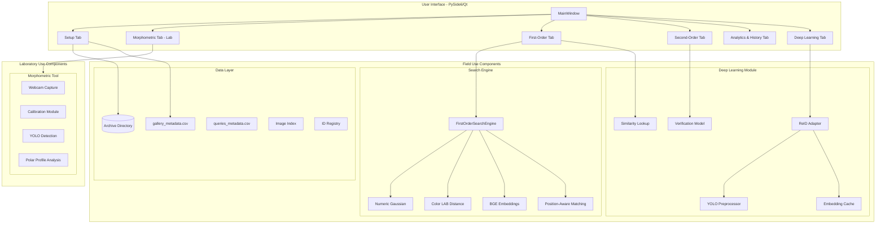

# starBoard

**Photo-ID and morphometric analysis platform for *Pycnopodia helianthoides* (sunflower sea star) conservation research**

*Designed for both field and laboratory use*


---

## Table of Contents

- [Overview](#overview)
- [Features](#features)
- [System Architecture](#system-architecture)
- [Installation](#installation)
- [Quick Start Guide](#quick-start-guide)
- [Detailed Module Documentation](#detailed-module-documentation)
- [Workflow Guide for Biologists](#workflow-guide-for-biologists)
- [Configuration Reference](#configuration-reference)
- [Technical Reference](#technical-reference)
- [Troubleshooting](#troubleshooting)
- [Contributing](#contributing)
- [Citation and Acknowledgments](#citation-and-acknowledgments)

---

## Overview

### Conservation Context

The sunflower sea star (*Pycnopodia helianthoides*) has experienced catastrophic population declines of over 90% since 2013 due to Sea Star Wasting Disease (SSWD). Once the largest sea star in the world—reaching up to 1 meter in diameter with 16-24 arms—this keystone predator played a crucial role in maintaining kelp forest ecosystems by controlling sea urchin populations.

Conservation efforts now require:
- **Individual identification** to track survival and movement
- **Population monitoring** without invasive marking techniques
- **Growth tracking** to understand recovery dynamics
- **Re-sighting history** to estimate survival rates

### What This Tool Does

**starBoard** is a desktop application designed for both **field** and **laboratory** workflows, enabling researchers to:

**Field Use (Photo-ID Pipeline):**
1. **Identify individual sea stars** from photographs using unique morphological features (arm patterns, colors, stripe characteristics, regenerating arms)
2. **Match new sightings** against a gallery of known individuals using both manual annotation and AI-powered visual recognition
3. **Maintain encounter histories** tracking where and when each individual was observed
4. **Make and review match decisions** with full audit trails

**Laboratory Use (Morphometric Analysis):**
5. **Record calibrated morphometric measurements** including body size, arm lengths, surface area, and estimated volume using webcam-based checkerboard calibration

### Why Photo-ID Works for Sea Stars

Sunflower sea stars exhibit several characteristics that make them suitable for photo-identification:

| Feature | Description | Persistence |
|---------|-------------|-------------|
| **Arm number** | 16-24 arms; exact count varies by individual | Stable (unless regenerating) |
| **Short/regenerating arms** | Position and relative size of small arms | Semi-stable (changes over months) |
| **Stripe patterns** | Radial stripes along arms with varying prominence | Stable |
| **Color variation** | Purple, orange, brown, pink; often multi-colored | Stable |
| **Madreporite position** | Sieve plate location relative to arm arrangement | Stable |
| **Rosette patterns** | Raised papulae clusters on dorsal surface | Stable |

---

## Features

### Field Use Features

| Category | Capability | Description |
|----------|------------|-------------|
| **Data Management** | Image Archive | Organized storage of gallery (known) and query (unknown) individuals |
| | Encounter Tracking | Date-stamped observation sessions with location metadata |
| | Batch Upload | Import multiple images with automatic folder discovery |
| | Merge/Revert | Combine confirmed matches; undo operations with full history |
| **Annotation** | 30+ Morphological Fields | Numeric measurements, color categories, ordinal traits |
| | Short Arm Coding | Position-specific notation for regenerating arms |
| | Extensible Vocabularies | User-defined color and location terms |
| | Best Photo Selection | Mark representative images for each individual |
| **Search & Matching** | First-Order Search | Rank gallery by metadata similarity to query |
| | Field-Weighted Scoring | Customize importance of each annotation field |
| | Visual Similarity | Deep learning-based appearance matching |
| | Fusion Ranking | Blend metadata and visual scores with adjustable weighting |
| **Deep Learning** | MegaStarID Model | ConvNeXt-small backbone trained on 140k+ wildlife images |
| | YOLO Segmentation | Automatic star detection and background removal |
| | Precomputation | Offline embedding extraction for instant queries |
| | Verification Model | Pair-wise match confirmation scoring |
| **Visualization** | Image Strips | Fast preview of all photos per individual |
| | Side-by-Side Compare | Synchronized pan/zoom for detailed comparison |
| | Match History | Timeline and matrix views of past decisions |
| | Interaction Logging | Analytics on annotation workflow |

### Laboratory Use Features

| Category | Capability | Description |
|----------|------------|-------------|
| **Morphometrics** | Checkerboard Calibration | Sub-millimeter measurement accuracy via webcam |
| | Arm Detection | Automatic arm tip localization with manual correction |
| | Size Measurements | Area, arm lengths, major/minor axes, estimated volume |
| | Water Refraction Correction | Calibrate through water for aquarium measurements |
| | Depth Estimation | Optional 3D volume calculation |

---

## System Architecture



### Component Overview

| Component | Location | Purpose |
|-----------|----------|---------|
| Main Application | `main.py` | Entry point, logging setup, Qt application |
| UI Layer | `src/ui/` | All tab implementations and widgets |
| Data Layer | `src/data/` | Archive paths, CSV I/O, validators, annotation schema |
| Search Engine | `src/search/` | Field scorers and ranking logic |
| Deep Learning | `src/dl/` | Model loading, precomputation, similarity lookup |
| MegaStarID Training | `star_identification/megastarid/` | Model training scripts |
| Morphometric Tool | `starMorphometricTool/` | Laboratory measurement application (webcam-based) |

---

## Installation

### Prerequisites

- **Python 3.9 or higher** (3.9 recommended for best compatibility)
- **Anaconda or Miniconda** (recommended for environment management)
- **8GB+ RAM** (16GB recommended for deep learning features)
- **NVIDIA GPU with CUDA** (optional but recommended for deep learning)

### Step 1: Install Anaconda

If you don't have Anaconda installed:

1. Download from [anaconda.com/download](https://www.anaconda.com/download)
2. Run the installer for your operating system
3. Verify installation:

```bash
conda --version
# Should output: conda 24.x.x or similar
```

### Step 2: Create Environment

```bash
# Create a new environment with Python 3.9
conda create -n starboard python=3.9 -y

# Activate the environment
conda activate starboard
```

### Step 3: Install Core Dependencies

```bash
# Core application dependencies
pip install PySide6 pandas numpy pillow scipy tqdm

# For text embedding search (optional but recommended)
pip install sentence-transformers
```

### Step 4: Install Deep Learning Dependencies (Optional)

For GPU-accelerated visual re-identification:

```bash
# Install PyTorch with CUDA support (adjust cu121 for your CUDA version)
pip install torch torchvision --index-url https://download.pytorch.org/whl/cu121

# Install remaining DL dependencies
pip install -r requirements-dl.txt
```

**requirements-dl.txt includes:**
- `torch>=2.0.0` - Deep learning framework
- `torchvision>=0.15.0` - Image transforms
- `transformers>=4.30.0` - Transformer model support
- `ultralytics>=8.0.0` - YOLO instance segmentation
- `opencv-python>=4.8.0` - Image processing
- `albumentations>=1.3.0` - Data augmentation
- `scikit-learn>=1.2.0` - Clustering and metrics

**For CPU-only installation:**

```bash
pip install torch torchvision --index-url https://download.pytorch.org/whl/cpu
pip install -r requirements-dl.txt
```

### Step 5: Download Model Weights

Model weights are hosted on GitHub Releases:

**[Download Models from GitHub Releases](https://github.com/weertman/starBoard/releases/tag/v1.0-models)**

#### Option A: Automatic Download (Recommended)

Run the built-in model downloader, which will check for missing models and download them automatically:

```bash
python -m src.utils.model_downloader
```

The app also checks for missing models on startup and offers to download them.

#### Option B: Manual Download

Download the following files from the [v1.0-models release](https://github.com/weertman/starBoard/releases/tag/v1.0-models) and place them in the specified locations:

| Download File | Size | Place In |
|---------------|------|----------|
| `starseg_best.pt` | 53 MB | `star_identification/wildlife_reid_inference/starseg_best.pt` |
| `megastarid_default.pth` | 336 MB | `star_identification/checkpoints/default/best.pth` |
| `megastarid_finetune.pth` | 336 MB | `star_identification/checkpoints/megastarid/finetune/best.pth` |
| `verification_circleloss.pth` | 623 MB | `star_identification/checkpoints/verification/extended_training/circleloss/nofreeze_inat1_neg0_20260109_050432/best.pth` |
| `morphometric_yolo.pt` | 20 MB | `starMorphometricTool/models/best.pt` |

> **Note:** At minimum, download `starseg_best.pt` and `megastarid_default.pth` for basic re-identification functionality.

### Step 6: Verify Installation

```bash
# Activate environment
conda activate starboard

# Launch the application
python main.py
```

The starBoard window should open. If you see the Deep Learning tab with status indicators, DL dependencies are correctly installed.

---

## Quick Start Guide

### 1. Launch the Application

```bash
conda activate starboard
python main.py
```

### 2. Understand the Interface

starBoard uses a tabbed interface:

| Tab | Purpose | Use Context |
|-----|---------|-------------|
| **Setup** | Upload images, create new IDs, edit metadata | Field & Lab |
| **Morphometric** | Measure specimens via calibrated webcam | Laboratory only |
| **First-Order** | Search gallery by metadata/visual similarity | Field & Lab |
| **Second-Order** | Detailed side-by-side comparison | Field & Lab |
| **Analytics & History** | Review decision history, merge confirmed matches | Field & Lab |
| **Deep Learning** | Manage models, run precomputation | Field & Lab |

### 3. Upload Your First Images

1. Go to **Setup** tab
2. Select **Single Upload Mode**
3. Choose target: **Gallery** (known individual) or **Queries** (unknown)
4. Click **Choose Files** and select images
5. Enter or select the **Individual ID** (e.g., "anchovy", "star_001")
6. Set the **Encounter Date** (observation date)
7. Click **Save**

### 4. Annotate Morphological Features

1. Stay in **Setup** tab, switch to **Metadata Edit Mode**
2. Select the ID you just created
3. Fill in observable features:
   - **Number of arms** (apparent and total)
   - **Tip-to-tip size** (if measured)
   - **Short arm codes** (positions of regenerating arms)
   - **Colors** (stripe, arm, disc, rosette)
   - **Stripe characteristics** (order, prominence, extent)
   - **Location** and notes
4. Click **Save Edits**

### 5. Run Deep Learning Precomputation

1. Go to **Deep Learning** tab
2. Ensure a model is registered and set as active
3. Click **Run Full Precomputation**
4. Wait for completion (progress bar shows ETA)

> Precomputation extracts visual embeddings from all images. This is a one-time operation per dataset; only new images need processing later.

### 6. Search for Matches

1. Go to **First-Order** tab
2. Select a **Query ID** to search for
3. Adjust search settings:
   - Check/uncheck annotation fields to include
   - Enable **Visual** checkbox for DL similarity
   - Adjust **Fusion** slider (0%=metadata only, 100%=visual only)
4. Click **Refresh** to run the search
5. Review ranked gallery candidates

### 7. Compare and Decide

1. Click **Pin for Compare** on promising candidates
2. Go to **Second-Order** tab
3. Select the Query and Gallery IDs to compare
4. Use synchronized pan/zoom viewers to examine details
5. Record your decision: **Yes** (match), **No** (different), or **Maybe** (uncertain)
6. Add notes and click **Save**

### 8. Merge Confirmed Matches

1. Go to **Analytics & History** tab
2. Review **Yes** decisions
3. For confirmed matches, use **Merge** to combine Query into Gallery
4. The Query images move to the Gallery individual's folder

---

## Detailed Module Documentation

### Archive Structure

starBoard uses a file-based archive with a standardized directory layout:

```
archive/
├── gallery/                          # Known individuals
│   ├── gallery_metadata.csv          # All annotations for gallery
│   ├── _embeddings/                   # BGE text embeddings cache
│   ├── anchovy/                       # Individual "anchovy"
│   │   ├── 03_15_24/                  # Encounter on March 15, 2024
│   │   │   ├── IMG_001.jpg
│   │   │   ├── IMG_002.jpg
│   │   │   └── ...
│   │   └── 06_22_24/                  # Another encounter
│   │       └── ...
│   ├── pepperoni/                     # Individual "pepperoni"
│   │   └── ...
│   └── ...
│
├── queries/                           # Unidentified individuals
│   ├── queries_metadata.csv
│   ├── Q_2024_001/
│   │   └── 04_10_24/
│   │       └── ...
│   └── ...
│
├── _dl_precompute/                    # Deep learning cache
│   ├── _dl_registry.json             # Model registry
│   └── <model_key>/                  # Per-model embeddings
│       ├── embeddings/
│       └── similarity/
│
├── reports/                           # Generated reports
│   └── past_matches_master.csv
│
└── starboard.log                      # Application log
```

### Encounter Naming Convention

Encounter folders follow the format: `MM_DD_YY` or `MM_DD_YY_suffix`

| Component | Format | Example |
|-----------|--------|---------|
| Month | 01-12 | `03` for March |
| Day | 01-31 | `15` |
| Year | 2-digit | `24` for 2024 |
| Suffix | Optional | `_morning`, `_dive2` |

**Examples:**
- `03_15_24` - March 15, 2024
- `06_22_24_dock` - June 22, 2024 at dock site
- `11_03_24_pm` - November 3, 2024 afternoon session

### Annotation Schema

The annotation system supports 30+ typed fields organized into groups:

#### Numeric Measurements

| Field | Type | Range | Description |
|-------|------|-------|-------------|
| `num_apparent_arms` | Integer | 0-30 | Arms visible in photos |
| `num_total_arms` | Integer | 0-30 | Total arms including hidden |
| `tip_to_tip_size_cm` | Float | 0-150 | Maximum diameter |

#### Short Arm Coding

Regenerating or abnormally short arms are encoded with position and severity:

**Format:** `severity(position), severity(position), ...`

| Severity | Code | Description |
|----------|------|-------------|
| `short` | Normal short | Noticeably shorter than neighbors |
| `small` | Small short | Very short, ~25-50% of normal |
| `tiny` | Tiny | Barely visible, <25% of normal |

**Examples:**
- `short(3)` - Arm 3 is short
- `tiny(7), small(12)` - Arm 7 is tiny, arm 12 is small
- `short(1), short(2), tiny(3)` - Three affected arms

> Arm positions are numbered 1 to N clockwise from the madreporite.

#### Color Fields

All color fields use an extensible vocabulary:

| Field | Description |
|-------|-------------|
| `overall_color` | General impression |
| `arm_color` | Primary arm coloration |
| `stripe_color` | Color of radial stripes |
| `central_disc_color` | Central body region |
| `papillae_central_disc_color` | Papillae on disc |
| `rosette_color` | Raised papulae clusters |
| `papillae_stripe_color` | Papillae in stripe regions |
| `madreporite_color` | Sieve plate color |

**Default color vocabulary:**
`white`, `yellow`, `orange`, `peach`, `pink`, `red`, `maroon`, `burgundy`, `purple`, `mauve`, `brown`, `tan`, `light-purple`, `dark-orange`, `burnt-orange`, etc.

#### Ordinal Categorical Fields

| Field | Options |
|-------|---------|
| `stripe_order` | None (0), Mixed (1), Irregular (2), Regular (3) |
| `stripe_prominence` | None (0), Weak (1), Medium (2), Strong (3), Strongest (4) |
| `stripe_extent` | None (0), Quarter (0.25), Halfway (0.5), Three-quarters (0.75), Full (1.0) |
| `stripe_thickness` | None (0), Thin (1), Medium (2), Thick (3) |
| `arm_thickness` | Thin (0), Medium (1), Thick (2) |
| `rosette_prominence` | Weak (0), Medium (1), Strong (2) |
| `reticulation_order` | None (0), Mixed (1), Meandering (2), Train tracks (3) |

#### Image Quality Fields

| Field | Options | Purpose |
|-------|---------|---------|
| `madreporite_visibility` | Not visible (0) to Excellent (3) | Can you see the sieve plate? |
| `anus_visibility` | Not visible (0) to Excellent (3) | Can you see the anus (for orientation)? |
| `postural_visibility` | Very poor (0) to Excellent (4) | Is the star flat and fully visible? |

#### Text Fields

| Field | Description |
|-------|-------------|
| `location` | Where the star was observed (auto-complete from history) |
| `unusual_observation` | Any notable features or behaviors |
| `health_observation` | Signs of wasting, lesions, or disease |

#### Morphometric Auto-Fields

These fields are automatically populated when measurements are imported from the morphometric tool:

| Field | Unit | Description |
|-------|------|-------------|
| `morph_num_arms` | count | Arms detected by YOLO |
| `morph_area_mm2` | mm² | Calibrated surface area |
| `morph_major_axis_mm` | mm | Fitted ellipse major axis |
| `morph_minor_axis_mm` | mm | Fitted ellipse minor axis |
| `morph_mean_arm_length_mm` | mm | Average arm length |
| `morph_max_arm_length_mm` | mm | Longest arm |
| `morph_tip_to_tip_mm` | mm | Maximum diameter |
| `morph_volume_mm3` | mm³ | Estimated volume (requires depth) |

### Search Engine

The First-Order search engine computes similarity scores between a query and all gallery individuals.

#### Scoring Algorithm

For each gallery candidate:

1. **Per-field scoring**: Each enabled field produces a similarity score in [0, 1]
2. **Presence filtering**: Fields contribute only if both query and candidate have values
3. **Weighted average**: Final score = weighted mean of contributing field scores

```
Score = Σ(weight_f × score_f × present_f) / Σ(weight_f × present_f)
```

#### Field Scorers

| Field Type | Scorer | Algorithm |
|------------|--------|-----------|
| **Numeric** | `NumericGaussianScorer` | Gaussian decay: `exp(-|q-g| / (k × MAD))` where MAD is median absolute deviation |
| **Ordinal** | `NumericGaussianScorer` | Same as numeric (order matters) |
| **Color** | `ColorSpaceScorer` | CIELAB perceptual distance with configurable threshold |
| **Text** | `TextEmbeddingBGEScorer` | BGE-small embedding cosine similarity |
| **Text (fallback)** | `TextNgramScorer` | Character 3-5 gram Jaccard similarity |
| **Short Arm** | `ShortArmCodeScorer` | Position-aware bipartite matching with Hungarian algorithm |

#### Short Arm Code Matching Details

The short arm scorer handles the complex task of comparing regenerating arm patterns:

1. **Parse codes** into `{position: severity}` pairs
2. **Position similarity**: Gaussian decay on circular distance (σ=1.0)
3. **Severity similarity**: Ordinal matching (same=1.0, off-by-one=0.5)
4. **Optimal pairing**: Hungarian algorithm finds best arm-to-arm matching
5. **Normalization**: Divide by max(|query arms|, |gallery arms|) to penalize missing arms

### Deep Learning Pipeline

#### Architecture Overview

The deep learning system uses a **precomputation-first architecture**:

```
┌─────────────────────────────────────────────────────────────────┐
│                    OFFLINE (One-Time)                           │
├─────────────────────────────────────────────────────────────────┤
│  1. YOLO Preprocessing                                          │
│     - Detect star in image                                      │
│     - Segment from background                                   │
│     - Crop and resize to 640px                                  │
│     - Cache to precompute_cache/                                │
│                                                                 │
│  2. Embedding Extraction                                        │
│     - Load cached images                                        │
│     - Apply test transforms (384px, normalize)                  │
│     - Run through ConvNeXt + embedding head                     │
│     - Apply test-time augmentation (flip)                       │
│     - Aggregate with outlier rejection                          │
│                                                                 │
│  3. Similarity Matrix                                           │
│     - Compute all pairwise cosine similarities                  │
│     - Optional: k-reciprocal re-ranking                         │
│     - Save to archive/_dl_precompute/                           │
└─────────────────────────────────────────────────────────────────┘

┌─────────────────────────────────────────────────────────────────┐
│                    ONLINE (At Query Time)                       │
├─────────────────────────────────────────────────────────────────┤
│  - Load precomputed similarity matrix                           │
│  - Look up query row                                            │
│  - Return sorted gallery scores                                 │
│  - No neural network inference required!                        │
└─────────────────────────────────────────────────────────────────┘
```

#### Model Architecture

**MegaStarID** uses a ConvNeXt-small backbone, which was found to provide the best performance for sea star re-identification:

| Component | Configuration |
|-----------|---------------|
| Backbone | ConvNeXt-small |
| Input Size | 384 × 384 pixels |
| Embedding Dim | 512 |
| Pooling | GeM (Generalized Mean) |
| Training Loss | Circle Loss (0.7) + Triplet Loss (0.3) |

**Why ConvNeXt?**
- Best empirical performance on sea star re-identification tasks
- Modern CNN architecture with transformer-inspired design
- Efficient inference on both GPU and CPU
- Robust to the texture and pattern variations in sea star imagery

**Alternative backbones available:** DenseNet-121, DenseNet-169, SwinV2-tiny, ResNet-50

**Training Data:**
- **Wildlife10k**: 140,000 images across 37 species for broad feature learning
- **star_dataset**: 8,000 sunflower sea star images for domain-specific fine-tuning

#### Outlier Detection

When aggregating embeddings from multiple images of an individual:

1. Compute pairwise similarities between all image embeddings
2. For each image, find its nearest-neighbor similarity
3. Compute median and MAD of NN similarities
4. Flag images >3 MAD below median as outliers
5. Aggregate only inlier embeddings into final centroid

This removes:
- Wrong YOLO detections (different animal)
- Severely corrupted images
- Mislabeled images

#### Hardware Profiles

| Profile | Device | Batch Size | TTA | Speed |
|---------|--------|------------|-----|-------|
| GPU Quality | CUDA | 16 | H+V flip | ~50 img/s |
| GPU Fast | CUDA | 32 | H flip only | ~80 img/s |
| CPU Quality | CPU | 4 | H flip only | ~4 img/s |
| CPU Fast | CPU | 8 | None | ~8 img/s |

### Morphometric Tool (Laboratory Use)

The **Morphometric** tab provides calibrated measurements via webcam, designed for **laboratory settings** where specimens can be positioned under a fixed camera with a calibration checkerboard:

#### Laboratory Setup

**Equipment needed:**
- USB webcam (tested with Logitech C270)
- Flat, non-square checkerboard with known square dimensions
- Stable camera mount (tripod or fixed position)
- Consistent lighting (diffuse recommended)
- Optional: shallow water container for aquatic measurements

#### Calibration Process

1. **Position checkerboard** flat in camera view (or underwater if measuring through water)
2. **Enter parameters**: rows, columns, square size (mm)
3. **Detect checkerboard** to establish pixel-to-mm mapping
4. **Keep camera fixed** for all subsequent measurements

The calibration corrects for:
- Perspective distortion (oblique viewing angle)
- Lens distortion (barrel/pincushion)
- Water refraction (if measuring through water in an aquarium setting)

#### Measurement Procedure

In the laboratory:

1. Place specimen in **center of checkerboard area** (live or preserved)
2. Ensure star is flat and all arms are visible
3. Start YOLO detections
4. Capture when detection box appears
5. Run morphometrics analysis
6. Adjust parameters:
   - **Smoothing**: Reduce contour noise
   - **Prominence**: Arm tip detection sensitivity
   - **Distance**: Minimum separation between arms
7. Click to add/Shift+click to remove arm tips
8. Save with initials and notes

**Tips for best results:**
- Measurement accuracy decreases toward checkerboard edges—keep specimen centered
- Use consistent, diffuse lighting to avoid shadows
- For specimens with very short arms, manually adjust detection parameters
- Recalibrate if camera position changes

#### Measurements Collected

| Measurement | Unit | Method |
|-------------|------|--------|
| Total area | mm² | Calibrated mask pixel count |
| Number of arms | count | Polar profile peak detection |
| Individual arm lengths | mm | Center to each tip |
| Mean arm length | mm | Average of all arms |
| Max arm length | mm | Longest arm |
| Major axis | mm | Fitted ellipse |
| Minor axis | mm | Fitted ellipse |
| Tip-to-tip diameter | mm | Maximum across tips |
| Volume | mm³ | Depth estimation (optional) |

---

## Workflow Guide for Biologists

### Field vs. Laboratory Workflows

starBoard supports two complementary workflows:

| Workflow | Location | Primary Activities |
|----------|----------|-------------------|
| **Field Photo-ID** | Dive sites, docks, tidepools | Photograph encounters, upload images, annotate features, search for matches, record decisions |
| **Laboratory Morphometrics** | Lab with webcam setup | Calibrated size measurements, arm length analysis, growth tracking |

**Typical research workflow:**
1. **Field work** → Collect photographs of individuals in situ
2. **Post-dive processing** → Upload to starBoard, annotate, run matches
3. **Laboratory sessions** → Bring specimens in for precise measurements (if applicable)
4. **Data integration** → Morphometric data automatically populates annotation fields

### Setting Up a New Study

#### 1. Create Your Archive

The archive directory is automatically created on first launch at:
```
<project>/archive/
```

Or set a custom location by modifying `src/data/archive_paths.py`.

#### 2. Establish Your Gallery

Start with known individuals from previous studies, captive animals, or distinctively marked wild individuals:

1. **Gather reference photos** - Best images of each known individual
2. **Create consistent IDs** - Use memorable names or systematic codes
3. **Batch upload** - Use Setup tab's batch mode for efficient import
4. **Annotate thoroughly** - Complete all observable fields for best matching

**Recommended minimum per individual:**
- 3-5 images from different angles
- At least one clear dorsal view
- Complete arm count
- Short arm codes (if applicable)
- Primary colors noted

### Daily Workflow: Processing New Encounters

#### Step 1: Upload Field Images

After returning from fieldwork:

1. Transfer images from camera/phone
2. Open starBoard, go to **Setup** tab
3. For each new sighting:
   - Select **Queries** as target (unknown until confirmed)
   - Create new Query ID (e.g., `Q_2024_047`)
   - Set encounter date
   - Upload images

**Tip:** Use **Batch Upload** if you have images organized by individual in folders.

#### Step 2: Quick Visual Triage

Before detailed annotation:

1. Review image quality - Are key features visible?
2. Note obvious candidates - Does this look like a known individual?
3. Flag problematic images - Poor lighting, partial views, etc.

#### Step 3: Annotate Key Features

Focus on the most discriminating features first:

1. **Arm count** - Count carefully; short arms are easy to miss
2. **Short arm positions** - Critical for matching
3. **Overall color** - First impression
4. **Stripe prominence** - None/weak/medium/strong
5. **Location** - For spatial analysis

**Quality annotations >> Quantity.** A few well-annotated individuals are more valuable than many poorly annotated ones.

#### Step 4: Run Searches

1. Go to **First-Order** tab
2. Select your Query ID
3. Initial search settings:
   - Enable: arm counts, short arm code, overall color
   - Visual: ON (if precomputed)
   - Fusion: 50% (balanced)
4. Review top 10-20 candidates
5. **Pin** promising matches for detailed comparison

#### Step 5: Detailed Comparison

1. Go to **Second-Order** tab
2. For each pinned candidate:
   - Synchronize viewers on same features
   - Compare arm-by-arm
   - Check stripe patterns
   - Note color consistency
3. Record decision: Yes / No / Maybe
4. Add notes explaining your reasoning

### Interpreting Search Results

#### Understanding Scores

| Score Range | Interpretation |
|-------------|----------------|
| 0.8 - 1.0 | Strong match - Review carefully |
| 0.6 - 0.8 | Moderate match - Worth comparing |
| 0.4 - 0.6 | Weak match - Check if few fields contributed |
| 0.0 - 0.4 | Poor match - Unlikely to be same individual |

#### Field Breakdown

Each candidate shows which fields contributed and their individual scores:

```
Score: 0.72 (5 fields)
├── num_total_arms: 0.95
├── short_arm_code: 0.88
├── overall_color: 0.60
├── stripe_prominence: 0.55
└── location: 0.62
```

**Interpretation:**
- High arm/short-arm scores suggest morphological similarity
- Lower color scores may indicate lighting differences
- Check k_contrib (number of contributing fields) - more is better

#### When to Trust Visual vs. Metadata

| Scenario | Recommendation |
|----------|----------------|
| Good photos, complete annotations | Use 50/50 fusion |
| Poor photos, good annotations | Weight metadata higher (fusion < 30%) |
| Good photos, sparse annotations | Weight visual higher (fusion > 70%) |
| Query has few distinctive features | Rely more on visual similarity |
| Gallery individual has changed over time | Rely more on metadata (arm codes change less than appearance) |

### Managing the Gallery

#### Merging Confirmed Matches

When you're confident a Query matches a Gallery individual:

1. Go to **Analytics & History** tab
2. Find the **Yes** decision
3. Select the Gallery ID from the merge dropdown
4. Click **Merge**

**What happens:**
- Query images move to Gallery individual's folder
- Query metadata is preserved in CSV
- Decision is logged in audit trail
- Query ID becomes inactive

#### Handling Uncertain Cases

For **Maybe** decisions:

1. Wait for additional sightings
2. Collect more photos at next encounter
3. Focus annotation on distinguishing features
4. Re-run comparison when more data available

**Tips:**
- Don't rush to merge uncertain matches
- A false positive (merging different individuals) is worse than false negative (keeping them separate)
- Use notes field to record what additional evidence would confirm the match

#### Reverting Mistakes

If you merged incorrectly:

1. Go to **Analytics & History** tab → **Revert** section
2. Select the Gallery ID
3. Choose the batch to revert
4. Click **Revert Batch**

Images return to original Query location.

---

## Configuration Reference

### Environment Variables

| Variable | Default | Description |
|----------|---------|-------------|
| `STARBOARD_LOG_LEVEL` | `INFO` | Logging verbosity: `DEBUG`, `INFO`, `WARNING`, `ERROR` |
| `STARBOARD_DUMP_RANK_CSV` | (unset) | Set to `1` to export each ranking to CSV |
| `STARBOARD_SESSION_ID` | (auto) | Custom session ID for log correlation |

**Example:**

```bash
# Windows PowerShell
$env:STARBOARD_LOG_LEVEL = "DEBUG"
python main.py

# Linux/macOS
STARBOARD_LOG_LEVEL=DEBUG python main.py
```

### Fields Configuration

Access via **First-Order** tab → **Config** button:

| Setting | Description |
|---------|-------------|
| **Enable/Disable Fields** | Choose which fields contribute to ranking |
| **Field Weights** | Adjust relative importance (1.0 = normal) |
| **Numeric Offsets** | Shift query values for "what if" searches |

**Preset Configurations:**

| Preset | Fields Included |
|--------|-----------------|
| Average (All) | All non-empty fields equally weighted |
| Size Only | `num_total_arms`, `tip_to_tip_size_cm` |
| Colors Only | All color fields |
| Morphology | Arms, short arm codes, stripe characteristics |
| Text Only | Location and observation notes |

### Log Files

| Log | Location | Contents |
|-----|----------|----------|
| Main log | `archive/starboard.log` | Application events, search results |
| Interaction log | `archive/logs/*.csv` | User interaction analytics |
| Rank exports | `archive/logs/first_order_*.csv` | Per-query ranking details |

---

## Technical Reference

### Programmatic Usage

The search engine can be used directly for scripting or testing:

```python
from src.search.engine import FirstOrderSearchEngine

# Initialize and build indices
engine = FirstOrderSearchEngine()
engine.rebuild()

# Run a search
results = engine.rank(
    query_id="Q_2024_001",
    include_fields={"num_total_arms", "short_arm_code", "overall_color"},
    equalize_weights=True,
    top_k=20,
)

# Process results
for item in results:
    print(f"{item.gallery_id}: {item.score:.3f} ({item.k_contrib} fields)")
    for field, score in item.field_breakdown.items():
        print(f"  {field}: {score:.3f}")
```

### Deep Learning API

```python
from src.dl.similarity_lookup import get_visual_scores
from src.dl.registry import DLRegistry

# Get active model
registry = DLRegistry.load()
model_key = registry.active_model

# Get visual similarity scores for a query
if model_key:
    scores = get_visual_scores("Q_2024_001", model_key)
    # scores is Dict[str, float] mapping gallery_id -> similarity
    for gid, score in sorted(scores.items(), key=lambda x: -x[1])[:10]:
        print(f"{gid}: {score:.3f}")
```

### Model Training

For advanced users who want to train custom models:

#### Temporal Re-ID Training

```bash
cd star_identification

# Train with temporal split (recommended)
python -m temporal_reid.train \
    --dataset-root ./star_dataset \
    --epochs 25 \
    --batch-size 48 \
    --gpus 0,1

# Grid search over loss configurations
python -m temporal_reid.grid_search \
    --dataset-root ./star_dataset \
    --epochs 25
```

#### MegaStarID Training

```bash
cd star_identification

# Pre-train on Wildlife10k
python -m megastarid.pretrain --epochs 50

# Fine-tune on star_dataset
python -m megastarid.finetune \
    --checkpoint checkpoints/megastarid/pretrain/best.pth \
    --epochs 100

# Or co-train on both
python -m megastarid.cotrain --epochs 100 --star-batch-ratio 0.3
```

See [`star_identification/megastarid/readme.md`](star_identification/megastarid/readme.md) and [`star_identification/temporal_reid/readme.md`](star_identification/temporal_reid/readme.md) for detailed training documentation.

### Adding Custom Field Scorers

Implement the `FieldScorer` protocol:

```python
from src.search.interfaces import FieldScorer
from typing import Dict, Any, Tuple

class MyCustomScorer:
    name = "my_field"
    
    def build_gallery(self, gallery_rows_by_id: Dict[str, Dict]) -> None:
        """Build index from gallery data."""
        self._index = {}
        for gid, row in gallery_rows_by_id.items():
            value = row.get(self.name, "").strip()
            if value:
                self._index[gid] = self._parse(value)
    
    def prepare_query(self, query_row: Dict) -> Any:
        """Prepare query state from row data."""
        value = query_row.get(self.name, "").strip()
        return self._parse(value) if value else None
    
    def has_query_signal(self, query_state: Any) -> bool:
        """Check if query has usable data for this field."""
        return query_state is not None
    
    def score_pair(self, query_state: Any, gallery_id: str) -> Tuple[float, bool]:
        """Score query against gallery item. Returns (score, present)."""
        if gallery_id not in self._index:
            return 0.0, False
        gallery_state = self._index[gallery_id]
        score = self._compute_similarity(query_state, gallery_state)
        return score, True
    
    def _parse(self, value: str) -> Any:
        """Parse string value into internal representation."""
        return value
    
    def _compute_similarity(self, q: Any, g: Any) -> float:
        """Compute similarity in [0, 1]."""
        return 1.0 if q == g else 0.0
```

Register in `src/search/engine.py`:

```python
def _build_scorers(self, use_bge: bool) -> None:
    # ... existing scorers ...
    self.scorers["my_field"] = MyCustomScorer("my_field")
```

---

## Troubleshooting

### Common Issues

#### "Failed to load model"

**Symptoms:** Error message when accessing DL features

**Solutions:**
1. Check checkpoint path exists:
   ```
   star_identification/checkpoints/megastarid/best.pth
   ```
2. Verify PyTorch version compatibility
3. Check logs for specific error: `archive/starboard.log`

#### "YOLO preprocessor not available"

**Symptoms:** Precomputation fails at Phase 1

**Solutions:**
1. Install ultralytics: `pip install ultralytics`
2. Check model file exists:
   ```
   star_identification/wildlife_reid_inference/starseg_best.pt
   ```

#### Slow precomputation

**Symptoms:** Progress shows very low img/s rate

**Solutions:**
1. Use "Fast" speed mode on CPU
2. First run is slowest (building image cache)
3. Subsequent runs skip Phase 1 if cache exists
4. Consider GPU installation for 10x speedup

#### Deep Learning tab missing features

**Symptoms:** DL tab shows "Not Available" status

**Solutions:**
1. Install DL dependencies: `pip install -r requirements-dl.txt`
2. Verify PyTorch imports work:
   ```python
   python -c "import torch; print(torch.__version__)"
   ```

#### Image strip stuttering

**Symptoms:** Slow/jerky image preview when scrolling

**Solutions:**
1. Image strip uses scaled decoding; very large images may still be slow
2. Reduce preview size in code if needed
3. Use SSD storage for archive

#### Search returns no results

**Symptoms:** First-order tab shows empty lineup

**Causes:**
1. Query has no values for enabled fields
2. No gallery individuals have matching fields
3. Engine not rebuilt after data changes

**Solutions:**
1. Enable more fields in search settings
2. Check query has annotations saved
3. Click "Rebuild" button

#### Merge fails

**Symptoms:** Error when trying to merge Query into Gallery

**Solutions:**
1. Ensure Query ID exists and has images
2. Check Gallery ID is valid
3. Verify no file permission issues
4. Check logs for specific error

### Getting Help

1. **Check logs:** `archive/starboard.log` contains detailed error information
2. **Enable debug mode:** Set `STARBOARD_LOG_LEVEL=DEBUG`
3. **File an issue:** Include log excerpts and steps to reproduce

---

## Contributing

Contributions are welcome! Areas of interest:

- **Field scorers** for additional metadata types
- **UI improvements** for annotation efficiency
- **Model architectures** for improved re-identification
- **Documentation** and tutorials

### Development Setup

```bash
# Clone repository
git clone <repository-url>
cd starBoard

# Create development environment
conda create -n starboard-dev python=3.9 -y
conda activate starboard-dev

# Install all dependencies
pip install -r requirements-dl.txt
pip install pytest black flake8

# Run application
python main.py
```

### Code Style

- Follow PEP 8 guidelines
- Use type hints for function signatures
- Document public APIs with docstrings
- Log important operations with appropriate levels

---

## Citation and Acknowledgments

### Citation

If you use starBoard in your research, please cite:

```bibtex
@software{starboard2024,
  title = {starBoard: Photo-ID and Morphometric Analysis Platform for Sea Star Conservation},
  year = {2024},
  url = {https://github.com/[repository]}
}
```

### Acknowledgments

- **Friday Harbor Laboratories** - Field site and specimen access
- **Wildlife10k Dataset** - Pre-training data for visual re-identification
- **Meta AI Research** - ConvNeXt architecture
- **Ultralytics** - YOLO implementation

### Related Projects

- [MegaDetector](https://github.com/microsoft/CameraTraps) - Wildlife detection in camera trap images
- [Wildlife ReID-10k](https://www.kaggle.com/datasets/wildlifedatasets/wildlifereid-10k) - Benchmark dataset for wildlife re-identification
- [Wildbook](https://www.wildbook.org/) - Individual animal identification platform

---

## License

[License information to be added]

---

*starBoard is developed for sunflower sea star conservation research. For questions or collaborations, please contact the development team.*

