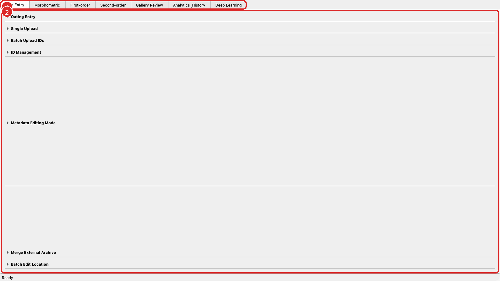
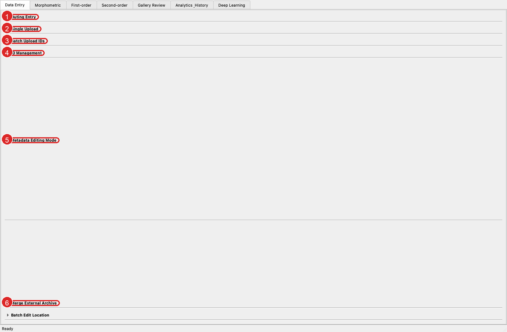
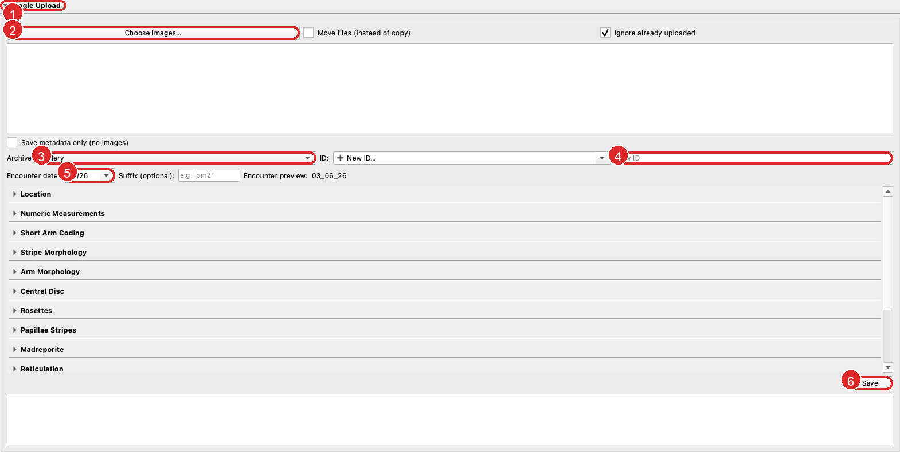
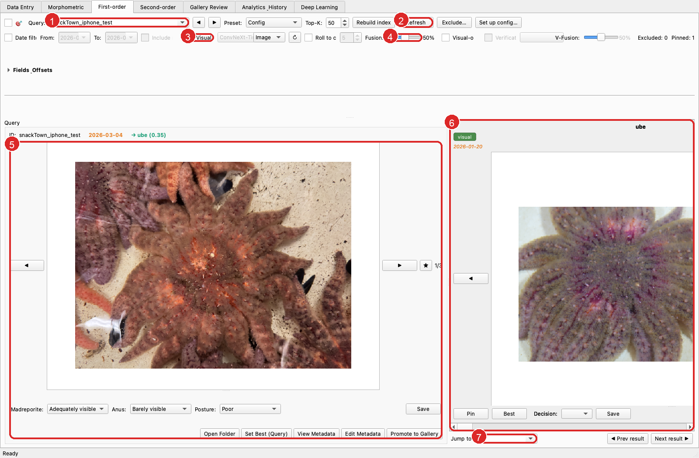
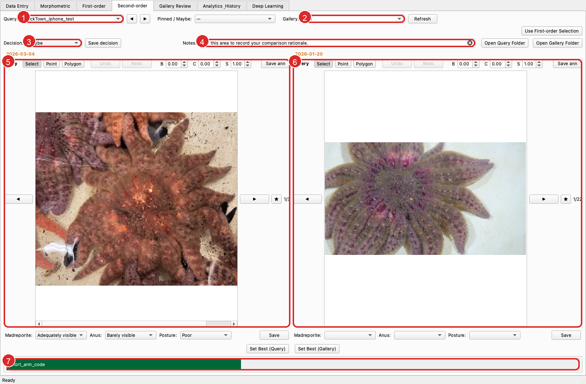
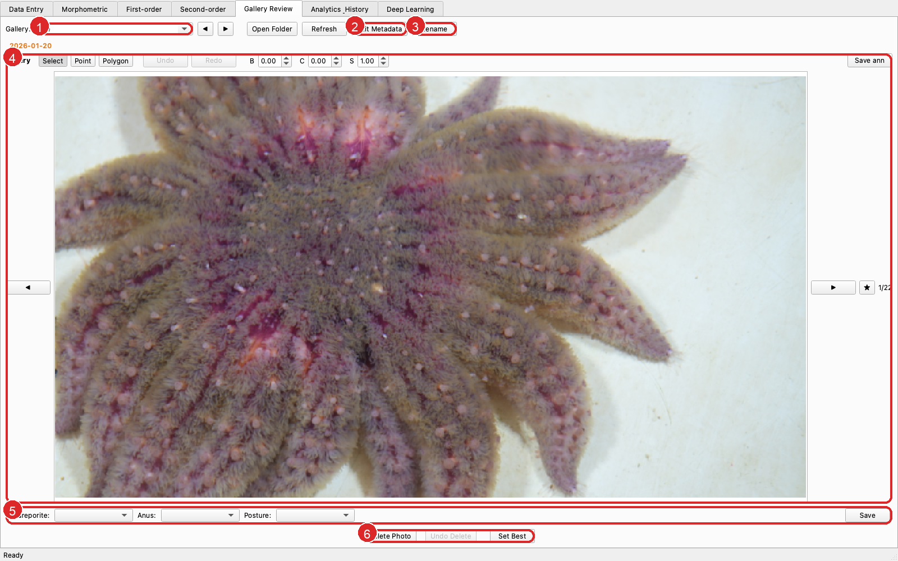
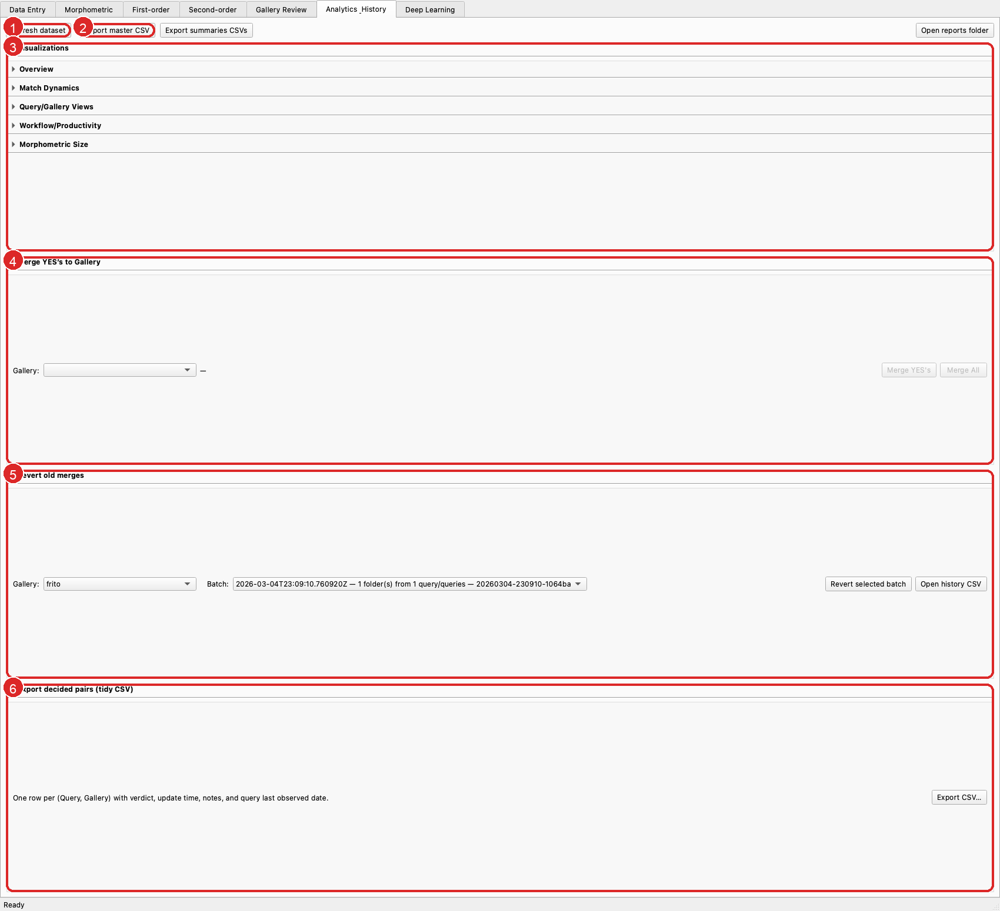
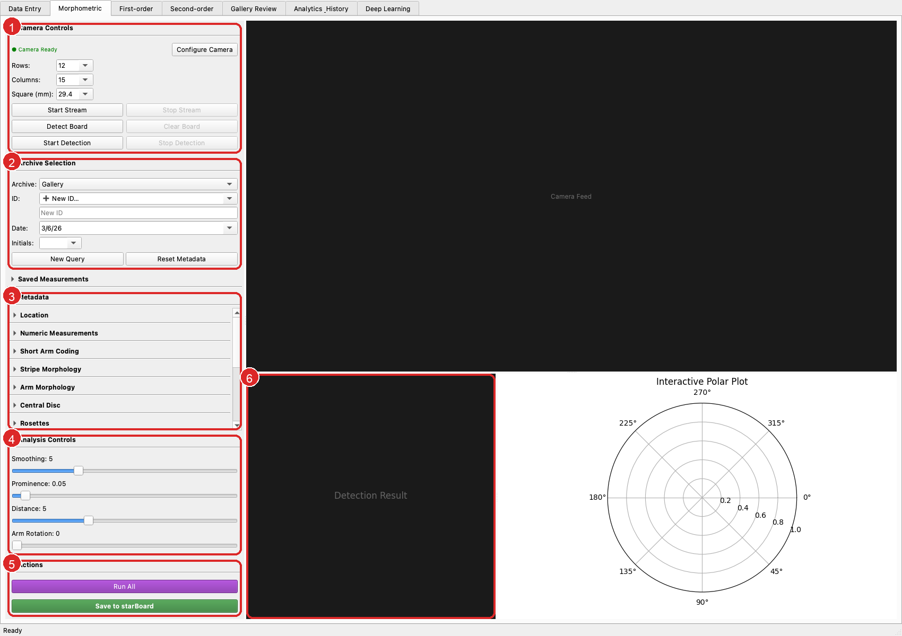
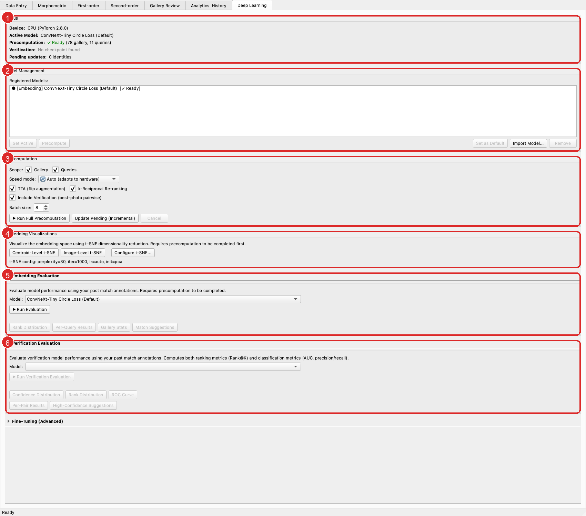
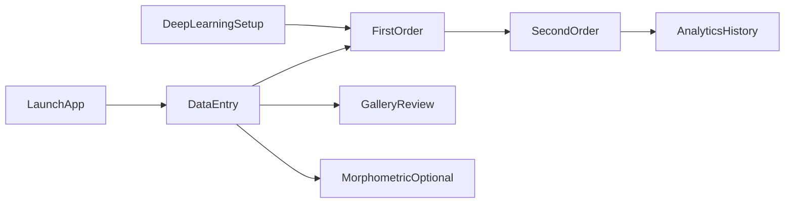

# starBoard Interface Guide

This guide walks through the main tabbed `starBoard` application and shows where the core workflows live in the interface.

It focuses on the main desktop app launched from `main.py`. The standalone morphometric companion app is not covered here.

## Getting Oriented
When `starBoard` opens, the app is organized around a tab bar across the top. Each tab maps to a major research workflow.

1. Use the top tab bar to move between the main workflows.
2. The large central workspace changes based on the currently selected tab.

### Tab Overview
| Tab | Use It For |
| --- | --- |
| `Data Entry` | Uploading images, creating IDs, editing metadata, and managing archive records |
| `Morphometric` | Lab-style camera capture and morphometric measurement |
| `First-order` | Ranking likely gallery matches for a selected query |
| `Second-order` | Side-by-side comparison and decision making |
| `Gallery Review` | Reviewing one gallery individual at a time |
| `Analytics & History` | Merges, reverts, exports, and reporting |
| `Deep Learning` | Model management and precomputation workflows |

## Data Entry
Use `Data Entry` to ingest new photos, create or update identities, and maintain archive metadata.

1. `Outing Entry` logs observation sessions without uploading images.
2. `Single Upload` is the fastest way to add a new gallery or query sighting.
3. `Batch Upload IDs` imports many organized folders at once.
4. `ID Management` is for opening, renaming, refreshing, or deleting IDs.
5. `Metadata Editing Mode` lets you review and update annotations for an existing ID.
6. `Merge External Archive` helps bring in records from another archive structure.

`Batch Edit Location` is also available at the bottom of the tab for bulk location updates.

### Single Upload
If you are onboarding a new user, this is usually the first section to demonstrate.

1. Open the `Single Upload` section.
2. Click `Choose images...` to pick one or more files.
3. Choose whether the upload belongs in the `Gallery` or `Queries` archive.
4. Enter a new ID when needed.
5. Set the encounter date before saving.
6. Click `Save` to write the upload into the archive.

## First-order
Use `First-order` to pick a query individual, run the search, and review ranked candidates.

1. Choose the query ID you want to search.
2. Use `Refresh` after changing filters or search settings.
3. Toggle `Visual` to include deep-learning similarity when precomputation is available.
4. Adjust the `Fusion` slider to blend metadata and visual ranking.
5. The left panel shows the selected query and its image controls.
6. The right panel shows the ranked gallery lineup.
7. Use the bottom result navigation to jump through ranked candidates.

Common onboarding path: pick a query, enable `Visual` if available, click `Refresh`, then review the top-ranked candidates before moving to `Second-order`.

## Second-order
Use `Second-order` for detailed side-by-side inspection and formal match decisions.

1. Select the query you want to compare.
2. Select the gallery candidate to inspect against that query.
3. Choose a decision such as `Yes`, `No`, or `Maybe`.
4. Record your comparison notes before saving.
5. The left viewer displays the query images.
6. The right viewer displays the gallery images.
7. The metadata difference bar summarizes key field comparisons across the pair.

This is the best tab to demonstrate how `starBoard` turns a ranked suggestion into an explicit research decision.

## Gallery Review
Use `Gallery Review` to browse one gallery individual at a time and maintain its images and metadata.

1. Choose the gallery individual you want to review.
2. Open `Edit Metadata` to update the selected gallery record.
3. Use `Rename` when an ID label needs to change.
4. The large viewer is for image-by-image inspection of the current gallery member.
5. The quality panel stores visibility and posture assessments for the current image.
6. The bottom action row is where you delete a photo, undo a delete during the current session, or set the best image.

This tab is especially useful for cleanup work after decisions or merges.

## Analytics & History
Use `Analytics & History` to export datasets, review prior work, merge confirmed matches, and reverse mistakes.

1. Refresh the dataset view after changes elsewhere in the app.
2. Export the master CSV for downstream analysis.
3. The `Visualizations` area opens reporting views such as totals, timeline, query/gallery summaries, and productivity views.
4. `Merge YES's to Gallery` is where confirmed query matches are folded into an existing gallery individual.
5. `Revert old merges` lets you undo a previous merge batch.
6. `Export decided pairs (tidy CSV)` writes a flat decision table for analysis or reporting.

The other collapsed visualization groups in this tab include overview, match dynamics, query/gallery views, workflow productivity, and morphometric size summaries.

## Morphometric
Use `Morphometric` for lab-style capture and measurement when you have a calibrated camera workflow.

1. `Camera Controls` manages calibration, stream control, and checkerboard detection.
2. `Archive Selection` chooses the target archive, ID, encounter date, and initials for the measurement record.
3. `Metadata` holds the annotation form that accompanies the morphometric save.
4. `Analysis Controls` adjusts smoothing, prominence, distance, and arm rotation.
5. `Actions` runs the analysis and saves results back into `starBoard`.
6. The right-side result area shows the detection result and interactive polar plot.

This tab is state-dependent. Camera previews, detections, and measurements will remain blank until the camera is configured and live data is available.

## Deep Learning
Use `Deep Learning` to manage models, precompute embeddings, and access evaluation tools.

1. `Status` shows device information, the active model, precomputation state, and pending updates.
2. `Model Management` lists available models and lets you activate, import, or remove them.
3. `Precomputation` controls what gets processed and how the run is configured.
4. `Embedding Visualizations` opens t-SNE views for identity-level or image-level exploration.
5. `Embedding Evaluation` is for ranking-oriented evaluation using existing decisions.
6. `Verification Evaluation` is for checkpoint-based verification metrics and suggestion tools.

This tab is also state-dependent. The exact labels, enabled buttons, and evaluation controls depend on which checkpoints are installed and whether precomputation has already been run.

## Typical Workflow
For most users, the everyday flow moves through a small subset of tabs:

1. Start in `Data Entry` to upload images and create or update IDs.
2. Use `Metadata Editing Mode` to fill in key observable features.
3. Move to `First-order` to rank likely gallery matches.
4. Open `Second-order` to compare the query and a candidate in detail.
5. Save a `Yes`, `No`, or `Maybe` decision with notes.
6. Use `Analytics & History` to merge confirmed matches, revert mistakes, or export results.
7. Use `Gallery Review` whenever you need to clean up or curate a specific gallery individual.
8. Use `Morphometric` only when you are working with the calibrated lab workflow.
9. Use `Deep Learning` mainly for setup, maintenance, and evaluation rather than daily review.

## Notes
- Screenshot contents such as ID names, dates, and active models will vary with your archive.
- Some buttons may appear disabled until a required model, camera, or dataset state is available.
- `First-order`, `Second-order`, and `Gallery Review` are image-dependent, so the exact thumbnails will differ across projects.
