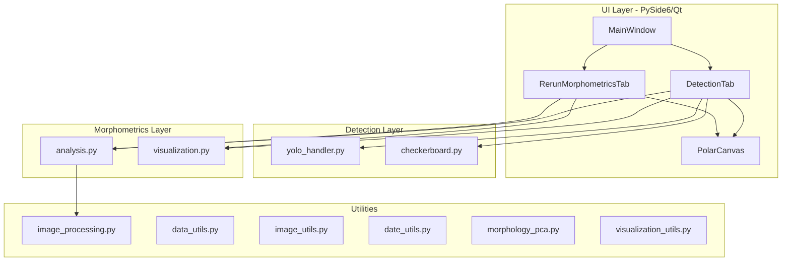
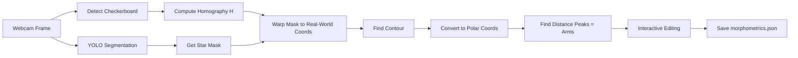

# starMorphometricTool - Application Architecture Map

**Created:** January 19, 2025  
**Purpose:** Complete documentation of the starMorphometricTool application architecture

---

## Overview

**starMorphometricTool** is a Python/PySide6 desktop application designed for measuring the morphology (shape and size) of sunflower sea stars (*Pycnopodia helianthoides*). The tool enables researchers to:

- Capture live webcam images of specimens
- Use YOLO-based object detection to segment the star from the background
- Apply checkerboard calibration to convert pixel measurements to real-world millimeters
- Perform polar profile analysis to detect and number the star's arms
- Interactively correct arm detection through a polar plot interface
- Save structured morphometric data for longitudinal analysis

---

## Architecture Overview



---

## Module Breakdown

### Entry Point

| File | Description |
|------|-------------|
| `src/starMorphometricTool/main.py` | Application entry point. Initializes QApplication, creates MainWindow, configures logging to `debug_log.txt` |

**Key code:**
```python
def main():
    app = QApplication(sys.argv)
    window = MainWindow()
    window.show()
    sys.exit(app.exec())
```

---

### UI Layer (`ui/`)

#### `main_window.py`
- **Class:** `MainWindow(QMainWindow)`
- **Purpose:** Main application window container with tab interface
- **Components:**
  - `DetectionTab` - Primary measurement workflow
  - `RerunMorphometricsTab` - Re-analyze existing measurements
- **Window size:** 1200x800 pixels

#### `detection_tab.py`
- **Class:** `DetectionTab(QWidget)`
- **Purpose:** Core measurement workflow - handles the complete pipeline from webcam capture to morphometric analysis
- **Key State Variables:**
  - `yolo_model` - Loaded YOLO model instance
  - `yolo_active` - Boolean flag for detection overlay
  - `cap` - OpenCV VideoCapture for webcam
  - `checkerboard_info` - Detected calibration data
  - `current_measurement_folder` - Path to active measurement
  - `angles_sorted`, `distances_smoothed`, `peaks` - Polar profile data
  - `arm_data` - List of `[arm_number, x_vec, y_vec, length_mm]`
  - `morphometrics_data` - Complete measurement dictionary

- **UI Components:**
  - Left panel: Configuration form (checkerboard dimensions, group/ID inputs, user metadata)
  - Left panel: Action buttons (stream control, detection, YOLO, morphometrics)
  - Left panel: Sliders (smoothing, prominence, distance, arm rotation, zoom)
  - Right panel: Camera feed display (`camera_label`)
  - Right panel: Detection result display (`result_label`)
  - Right panel: Interactive polar plot (`PolarCanvas`)

- **Key Methods:**
  | Method | Purpose |
  |--------|---------|
  | `start_stream()` / `stop_stream()` | Control webcam timer (30ms interval) |
  | `update_frame()` | Render camera feed with YOLO/checkerboard overlays |
  | `detect_checkerboard()` | Find and store calibration corners |
  | `start_yolo()` / `stop_yolo()` | Toggle YOLO detection overlay |
  | `save_corrected_detection()` | Capture frame, apply homography, save artifacts |
  | `correct_detections()` | Apply checkerboard homography to YOLO masks |
  | `run_morphometrics()` / `perform_morphometrics_analysis()` | Execute full morphometric analysis |
  | `update_arm_visualization()` | Redraw arm numbering plot |
  | `on_peaks_changed()` | Handle interactive peak editing from polar canvas |
  | `save_updated_morphometrics()` | Write final morphometrics.json |

- **Platform-specific webcam backends:**
  - Windows: `cv2.CAP_DSHOW`
  - macOS: `cv2.CAP_AVFOUNDATION`
  - Linux: `cv2.CAP_ANY`

#### `rerun_morphometrics_tab.py`
- **Class:** `RerunMorphometricsTab(QWidget)`
- **Purpose:** Load existing measurement folders and re-run morphometric analysis with different parameters
- **Key Features:**
  - Select any `mFolder_*` directory
  - Validates required files exist (`corrected_detection.json`, `corrected_mask.png`, `corrected_object.png`)
  - Loads existing morphometrics if available
  - Same slider controls and polar canvas as DetectionTab
  - Can overwrite `morphometrics.json` with updated analysis

#### `components/polar_canvas.py`
- **Class:** `PolarCanvas(FigureCanvas)`
- **Purpose:** Interactive matplotlib polar plot embedded in Qt
- **Interaction:**
  - **Normal click:** Add new peak at clicked angle
  - **Shift+click:** Remove nearest existing peak
- **Signal:** `peaksChanged(np.ndarray)` - Emitted when peaks are modified
- **Polar axis configuration:**
  - `theta_direction = -1` (clockwise angles)
  - `theta_offset = 0` (0° at right)
- **Key Methods:**
  | Method | Purpose |
  |--------|---------|
  | `set_data(angles, distances, peaks)` | Initialize polar profile |
  | `on_click(event)` | Handle mouse interaction |
  | `update_plot()` | Redraw distance profile and arm labels |
  | `set_arm_labels(angles, distances, labels, colors)` | Set numbered arm markers |

---

### Detection Layer (`detection/`)

#### `yolo_handler.py`
- **Functions:**
  | Function | Purpose |
  |----------|---------|
  | `load_yolo_model(path)` | Load YOLO model from `models/best.pt` (default) |
  | `select_primary_detection(results)` | Extract first valid detection with mask, box, class_id, confidence |

- **Detection dictionary structure:**
```python
{
    'mask': np.ndarray,      # 2D uint8 binary mask
    'box': np.ndarray,       # [x1, y1, x2, y2] bounding box
    'class_id': int,         # Class index (2 = Pycnopodia_helianthoides)
    'confidence': float      # Detection confidence score
}
```

#### `checkerboard.py`
- **Functions:**
  | Function | Purpose |
  |----------|---------|
  | `find_checkerboard(frame, board_dims)` | Detect corners using `cv2.findChessboardCorners()` + subpixel refinement |
  | `compute_checkerboard_homography(image_points, board_dims, square_size)` | Compute 3x3 homography matrix H |
  | `calculate_mm_per_pixel(H, img_pts, obj_pts)` | Calculate real-world scale factor |

- **Checkerboard info dictionary:**
```python
{
    'dims': (cols-1, rows-1),     # Internal corner grid dimensions
    'corners': np.ndarray,        # Raw detected corners
    'image_points': np.ndarray,   # Refined corner coordinates
    'square_size': float          # Known square size in mm
}
```

---

### Morphometrics Layer (`morphometrics/`)

#### `analysis.py`
- **Functions:**
  | Function | Purpose |
  |----------|---------|
  | `find_arm_tips(contour, center, smoothing, prominence, distance)` | Detect arm tips from contour |
  | `calculate_morphometrics(contour, mm_per_pixel)` | Compute area, center, ellipse fit |

- **`find_arm_tips()` Algorithm:**
  1. Shift contour to center as origin
  2. Convert (x, y) to polar coordinates (angle, distance)
  3. Sort points by angle
  4. Apply `uniform_filter1d()` smoothing to distance profile
  5. Find peaks using `scipy.signal.find_peaks()` with prominence/distance thresholds
  6. Roll array and re-detect peaks to handle boundary cases
  7. Merge peaks, sort by distance (descending), limit to 24 max
  8. Return arm tips sorted by angle for consistent numbering

- **Returns tuple:**
```python
(
    arm_tips,           # (N, 2) array of tip coordinates in original space
    angles_sorted,      # Sorted angles for polar plot
    distances_smoothed, # Smoothed distance profile
    peaks,              # Indices of detected peaks
    sorted_indices,     # Indices that sorted the angles
    shifted_contour     # Contour with center as origin
)
```

#### `visualization.py`
- **Functions:**
  | Function | Purpose |
  |----------|---------|
  | `create_morphometrics_visualization(ax, image, center, arm_data, rotation, ellipse, morpho)` | Draw numbered arms and measurements on matplotlib axis |
  | `render_figure_to_pixmap(fig, widget)` | Convert matplotlib figure to QPixmap |

- **Visualization features:**
  - Lines from center to each arm tip
  - Numbered labels at midpoint of each arm line
  - Arm 1 highlighted in red, others in blue
  - Yellow ellipse overlay (if fitted)
  - Text box with area, arm count, axis lengths

---

### Utilities (`utils/`)

#### `image_processing.py`
| Function | Purpose |
|----------|---------|
| `smooth_closed_contour(points, iterations)` | Moving-average smoothing for closed contours |
| `warp_points(points, H)` | Apply homography transformation to point array |

#### `data_utils.py`
| Function | Purpose |
|----------|---------|
| `convert_numpy_types(obj)` | Recursively convert numpy types to Python natives for JSON |
| `load_morphometrics(file_path)` | Load and return morphometrics.json data |
| `get_arm_lengths(morphometrics)` | Extract list of arm lengths in mm |
| `calculate_arm_diameters(morphometrics)` | Calculate tip-to-tip diameters for opposed arms |

#### `image_utils.py`
| Function | Purpose |
|----------|---------|
| `normalize_corrected_objects(images, morpho_list, target_angle)` | Rotate images so arm 1 points up, crop to content, pad to uniform size |

#### `date_utils.py`
| Function | Purpose |
|----------|---------|
| `convert_to_datetime64(date_string)` | Parse `mm_dd_yyyy` format to `numpy.datetime64` |

#### `morphology_pca.py`
| Function | Purpose |
|----------|---------|
| `compute_morphology_pca(df, columns, n_components)` | Standardize features and perform PCA |
| `visualize_morphology_pca(pca_df, color_by, title)` | Scatter plot of PC1 vs PC2 |
| `plot_pca_by_individual(pca_df, min_measurements)` | Connect same-individual points across time |
| `create_interactive_pca_plot(pca_df, color_by)` | Plotly interactive version |
| `create_pca_biplot(pca_df, pca_model, features, ...)` | PCA biplot with loading vectors |

#### `visualization_utils.py`
| Function | Purpose |
|----------|---------|
| `visualize_pca_with_images(images, max_thumbnails, ...)` | PCA scatter plot with actual specimen image thumbnails |

---

## Data Flow Pipeline



### Detailed Steps:

1. **Webcam Capture:** Frame acquired at 30fps via OpenCV
2. **Checkerboard Detection:** User triggers detection, corners found and refined
3. **Homography Computation:** 3x3 matrix computed from known square size
4. **YOLO Detection:** Model predicts segmentation mask for star
5. **Perspective Correction:** Mask warped using homography to calibrated coordinate system
6. **Contour Extraction:** Largest contour found from corrected mask
7. **Center Calculation:** Centroid computed via image moments
8. **Polar Conversion:** Each contour point converted to (angle, distance) from center
9. **Peak Detection:** Arms identified as local maxima in distance profile
10. **Interactive Refinement:** User can add/remove peaks via polar plot
11. **Arm Numbering:** Arms numbered sequentially by angle, rotation offset applied
12. **Data Export:** All measurements saved to JSON

---

## File Storage Structure

```
measurements/
└── {group}/                          # e.g., "lab"
    └── {id_type}/                    # "knownID" or "unknownID"
        └── {id_value}/               # Specimen identifier (e.g., "star_001")
            └── {mm_dd_yyyy}/         # Measurement date
                └── mFolder_{n}/      # Sequential measurement folder
                    ├── raw_frame.png
                    ├── corrected_mask.png
                    ├── corrected_object.png
                    ├── checkerboard_with_object.png
                    ├── corrected_detection.json
                    └── morphometrics.json
```

### Output Files:

| File | Contents |
|------|----------|
| `raw_frame.png` | Original webcam frame |
| `corrected_mask.png` | Binary mask in calibrated coordinates |
| `corrected_object.png` | Cropped star image in calibrated coordinates |
| `checkerboard_with_object.png` | Composite showing checkerboard + object overlay |
| `corrected_detection.json` | Detection metadata, homography, polygon |
| `morphometrics.json` | Final morphometric measurements |

### `corrected_detection.json` Structure:
```json
{
    "class_id": 2,
    "class_name": "Pycnopodia_helianthoides",
    "real_world_coordinate": [x_mm, y_mm],
    "homography_matrix": [[...], [...], [...]],
    "corrected_polygon": [[[x, y], ...]],
    "mask_path": "...",
    "object_path": "...",
    "raw_frame_path": "...",
    "mm_per_pixel": 1.0,
    "combined_image_path": "..."
}
```

### `morphometrics.json` Structure:
```json
{
    "area_mm2": 1646.97,
    "num_arms": 16,
    "arm_data": [
        [1, 21.37, 18.05, 28.02],
        [2, 11.37, 21.05, 23.97],
        ...
    ],
    "major_axis_mm": 52.14,
    "minor_axis_mm": 46.48,
    "contour_coordinates": [[x, y], ...],
    "mm_per_pixel": 1.0,
    "arm_rotation": 0,
    "user_initials": "ABC",
    "user_notes": "..."
}
```

**arm_data format:** `[arm_number, x_vector, y_vector, length_mm]`
- `arm_number`: Sequential arm ID (1-N)
- `x_vector`: X component of vector from center to tip
- `y_vector`: Y component of vector from center to tip
- `length_mm`: Euclidean distance in millimeters

---

## Key Algorithms

### Arm Detection (`find_arm_tips`)

```python
# 1. Shift contour to center origin
shifted_contour = contour - center

# 2. Calculate polar coordinates
angles = np.arctan2(shifted_contour[:, 1], shifted_contour[:, 0])
distances = np.hypot(shifted_contour[:, 0], shifted_contour[:, 1])

# 3. Sort by angle
sorted_indices = np.argsort(angles)
angles_sorted = angles[sorted_indices]
distances_sorted = distances[sorted_indices]

# 4. Smooth the distance profile
distances_smoothed = uniform_filter1d(distances_sorted, size=smoothing_factor)

# 5. Find peaks with prominence and distance constraints
peaks = find_peaks(distances_smoothed, 
                   prominence=prominence_factor * distances_smoothed.max(),
                   distance=distance_factor)[0]
```

### Checkerboard Calibration

```python
# 1. Detect checkerboard corners
found, corners = cv2.findChessboardCorners(gray, board_dims, None)

# 2. Refine corner positions to subpixel accuracy
corners_refined = cv2.cornerSubPix(gray, corners, (11, 11), (-1, -1), criteria)

# 3. Generate object points (real-world coordinates)
obj_pts = np.mgrid[0:board_dims[0], 0:board_dims[1]].T.reshape(-1, 2)
obj_pts *= square_size  # Convert to mm

# 4. Compute homography
H, status = cv2.findHomography(image_points, obj_pts)

# 5. Calculate mm per pixel
mm_per_pixel = real_distance_mm / pixel_distance
```

### Contour Smoothing

```python
def smooth_closed_contour(contour_points, iterations=2):
    N = len(contour_points)
    pts = contour_points.copy()
    for _ in range(iterations):
        smoothed = pts.copy()
        for i in range(N):
            i_prev = (i - 1) % N  # Wrap around for closed contour
            i_next = (i + 1) % N
            smoothed[i] = (pts[i_prev] + pts[i] + pts[i_next]) / 3.0
        pts = smoothed
    return pts
```

---

## Interactive Features

### Polar Canvas Interactions
- **Click:** Add new arm tip at nearest contour point to clicked angle
- **Shift+Click:** Remove the arm tip closest to clicked angle
- Changes propagate via `peaksChanged` signal to update visualizations

### Slider Controls
| Slider | Range | Effect |
|--------|-------|--------|
| Smoothing Factor | 1-15 | Window size for distance profile smoothing |
| Prominence Factor | 0.01-1.00 | Minimum peak height relative to max |
| Distance Factor | 0-15 | Minimum samples between peaks |
| Arm Rotation | 0 to N-1 | Starting arm number offset |
| Zoom | 50%-200% | Camera feed zoom level |

### Arm Rotation
- Rotates the numbering scheme without changing detected tips
- Arm 1 highlighted in red for orientation reference
- Final rotation value saved in `morphometrics.json`

---

## Post-Acquisition Analysis

Jupyter notebooks in `src/postAcquisitionAnalysis/`:

### `knownID_analysis.ipynb`
1. **Data Collection:** Traverses measurement directories, collects all `morphometrics.json` paths
2. **Feature Extraction:**
   - Area (mm²)
   - Major/minor axis lengths
   - Average arm length ± standard deviation
   - Average diameter ± standard deviation
3. **Visualization:**
   - Time series plots of each morphometric parameter
   - Individual tracking (same ID across dates connected by lines)
   - Mean ± std overlay in red
4. **PCA Analysis:**
   - Image-space PCA with specimen thumbnails
   - Feature-space PCA biplot with loading vectors
   - Track individual specimens through morphospace over time

### `multiLab_knownID_postAcquisition_analysis.ipynb`
- Extended analysis for multi-site data aggregation

---

## Dependencies

From `requirements.txt`:
```
opencv-python     # Image processing, webcam capture
numpy             # Array operations
torch             # PyTorch (for YOLO)
PySide6           # Qt GUI framework
ultralytics       # YOLO model handling
scipy             # Signal processing (find_peaks, uniform_filter1d)
matplotlib        # Visualization and polar plots
```

Additional imports used in notebooks:
- `pandas` - Data manipulation
- `sklearn` - PCA, StandardScaler
- `tqdm` - Progress bars
- `plotly` (optional) - Interactive plots

---

## Models

| File | Purpose |
|------|---------|
| `models/best.pt` | Primary trained YOLO model for sunflower star segmentation |
| `models/yolov8-n-pretrained.pt` | Base pretrained YOLOv8 nano model |

The custom model (`best.pt`) was trained to detect and segment *Pycnopodia helianthoides* with class ID 2.

---

## Checkerboard Generator

Located in `src/checkboardGenerator/`:
- `BoardsGenerator.py` - Script to generate calibration board images
- `checkerboards/` - Pre-generated boards of various sizes (3x5 to 65x67, various square sizes)

Board naming convention: `calibration_board_{cols}x{rows}_{square_size}mm.png`

---

## Logging

Application logs to `debug_log.txt` in the working directory:
- Log file cleared on each application start
- Format: `%(asctime)s %(levelname)s: %(message)s`
- Captures stream start/stop, detection events, errors

---

## Known Limitations & Notes

1. **Webcam dependency:** Application requires webcam access on startup
2. **Single detection:** Only processes first valid YOLO detection per frame
3. **Manual calibration:** Checkerboard must be manually detected before measurements
4. **Arm limit:** Maximum 24 arms detected (hardcoded in `find_arm_tips`)
5. **User initials validation:** Requires exactly 3 alphabetic characters
6. **File paths:** Uses relative paths which may cause issues if run from different directories

---

## File Summary

```
src/starMorphometricTool/
├── main.py                          # Entry point
├── detection/
│   ├── __init__.py
│   ├── checkerboard.py              # Calibration functions
│   └── yolo_handler.py              # YOLO model loading & detection
├── morphometrics/
│   ├── __init__.py
│   ├── analysis.py                  # Arm detection & measurements
│   └── visualization.py             # Matplotlib rendering
├── ui/
│   ├── __init__.py
│   ├── main_window.py               # Application window
│   ├── detection_tab.py             # Primary workflow tab
│   ├── rerun_morphometrics_tab.py   # Re-analysis tab
│   └── components/
│       ├── __init__.py
│       └── polar_canvas.py          # Interactive polar plot
└── utils/
    ├── __init__.py
    ├── data_utils.py                # JSON & data extraction
    ├── date_utils.py                # Date parsing
    ├── image_processing.py          # Contour smoothing, warping
    ├── image_utils.py               # Image normalization
    ├── morphology_pca.py            # PCA computation
    └── visualization_utils.py       # PCA with images
```

---

*End of Application Map*


